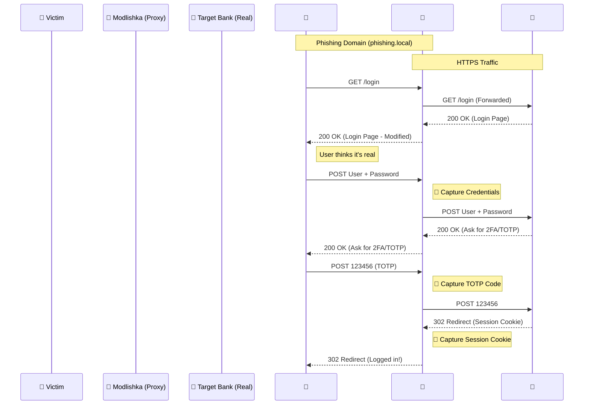

# Módulo 10: Phishing 2FA con Modlishka

> ⏱️ **Tiempo estimado**: 60 minutos

## 🎯 Objetivo de Aprendizaje
Entender la amenaza de los ataques de **Reverse Proxy Phishing** capaces de eludir la autenticación de doble factor (2FA) capturando no solo credenciales, sino también tokens SMS/TOTP y cookies de sesión.

---

## 🏗️ Arquitectura del Escenario

### Flujo del Ataque



El entorno incluye dos nuevos contenedores:

1.  **Víctima Simulada (`target-app`)**: Una aplicación bancaria falsa pero funcional.
    *   URL real (inaccesible directamente): `http://target-app`
    *   Flujo: Login -> 2FA (QR/TOTP Real) -> Dashboard.
2.  **Atacante (`modlishka`)**: Reverse Proxy malicioso.
    *   Dominio Phishing: `https://phishing.local`
    *   Intermediario: Cliente <-> Modlishka <-> Víctima.

---

## 🚀 Instrucciones de Ejecución

### 1. Configuración de DNS Local
Para simular un dominio, necesitamos engañar a tu ordenador para que `phishing.local` apunte a tu máquina local (donde corre Docker).

Edita tu archivo hosts:
*   **Mac/Linux**: `sudo nano /etc/hosts`
*   **Windows**: `notepad c:\windows\system32\drivers\etc\hosts` (Como admin)

Añade la siguiente línea:
```
127.0.0.1 phishing.local
```

### 2. Iniciar el Entorno
Asegúrate de reconstruir para crear los nuevos contenedores:
```bash
docker-compose up -d --build
```

### 3. El Ataque 🕵️‍♂️

1.  Abre tu navegador (Firefox/Chrome).
2.  Navega a: `https://phishing.local`
3.  **Advertencia de Seguridad**: Verás una alerta de certificado SSL no válido.
    *   *¿Por qué?* Modlishka ha generado un certificado autofirmado para `phishing.local`. En un ataque real, el atacante usaría Let's Encrypt para tener candado verde.
    *   **Acción**: Acepta el riesgo y continúa.
4.  Verás la página de login del banco. ¡Parece real!
5.  Introduce:
    *   User: `admin`
    *   Pass: `password123`
6.  **2FA Real** 📱:
    *   Aparecerá un **código QR** en pantalla.
    *   Abre tu app de autenticación (Google/Microsoft Authenticator) en tu móvil.
    *   Escanea el QR para añadir la cuenta "SecureBank Workshop".
    *   Introduce el código de 6 dígitos que aparece en tu móvil.
7.  Accederás al Dashboard.

### 4. Ver los Datos Robados 🔓

Mientras hacías esto, Modlishka ha estado interceptando todo.
Mira los logs del contenedor Modlishka:

```bash
docker logs -f workshop_modlishka
```

Busca líneas que contengan:
*   `Post data: username=admin...`
*   `Post data: otp=XXXXXX` (Tu código del móvil capturado).
*   **SESSION_ID**: ¡El atacante ha robado tu cookie de sesión! Con esto puede acceder a tu cuenta sin necesitar password ni 2FA.

### 4.b. Panel de Control Web 🕵️‍♀️

Modlishka incluye una interfaz web oculta para ver las capturas en tiempo real de forma gráfica.

1.  Abre tu navegador y ve a: **`https://phishing.local/SayHello2Modlishka`**
2.  Autentícate si te lo pide (típicamente `admin` / `modlishka`, revisa los logs de inicio si no funciona).
3.  Verás tablas con:
    *   **Tracked Users**: Víctimas activas.
    *   **Captured Credentials**: Usuarios y contraseñas.
    *   **2FA Tokens**: Códigos TOTP interceptados.
    *   **Notes**: Cookies de sesión y otros datos.

Es una herramienta visual muy potente para demostrar el impacto.

### 5. Secuestro de Sesión (Session Hijacking) 🏴‍☠️

Ahora actuarás como el atacante que quiere usar esa sesión robada para entrar al banco real.

1.  **Datos robados**: Copia el valor del `SESSION_ID` que aparece en los logs de Modlishka (será una cadena hexadecimal larga).
2.  **Sitio Real**: Abre una **Pestaña de Incógnito** (o usa otro navegador) y ve al "banco real" que corre en el puerto 8088:
    *   URL: `https://localhost:8088` (Acepta el certificado).
    *   Verás que te pide Login (no estás autenticado).
3.  **Inyección de Cookie**:
    *   Abre las **Herramientas de Desarrollador** (F12 o Clic Derecho -> Inspeccionar).
    *   Ve a la pestaña **Almacenamiento** (Storage) en Firefox o **Aplicación** (Application) en Chrome.
    *   En la sección **Cookies**, selecciona `https://localhost:8088`.
    *   Haz clic derecho -> "Añadir elemento" o doble clic en una fila vacía.
    *   **Nombre**: `SESSION_ID`
    *   **Valor**: (Pega el valor hexadecimal que copiaste del log).
    *   **Path**: `/` (Asegúrate de que este campo tenga una barra, o la cookie no servirá para todo el sitio).
    *   **Secure / HttpOnly**: Déjalos como estén.
4.  **Acceso**:
    *   Refresca la página (`F5`).
    *   ¡Estás dentro! Has accedido al `Dashboard` sin poner usuario, contraseña ni código 2FA.

---

## 🛡️ Contramedidas

¿Cómo detiene esto el **FIDO2 / WebAuthn** (Llaves de seguridad, Passkeys)?

A diferencia de los SMS/TOTP, WebAuthn vincula criptográficamente el login con el **dominio del navegador**.
*   Si estás en `google.com`, la llave firma para `google.com`.
*   Si estás en `phishing.local`, la llave firma para `phishing.local` (o se niega a firmar).
*   El servidor real (`google.com`) recibe una firma inválida y rechaza el acceso, deteniendo el ataque de Modlishka.

---

## 🎓 Fin del Taller

¡Felicidades por completar el **Taller Práctico de Seguridad en Contraseñas**!

### Resumen de Aprendizajes

| Módulo | Técnicas Aprendidas |
|--------|---------------------|
| **1** | Cracking offline, fuerza bruta, John/Hashcat |
| **2** | Diccionarios (rockyou, SecLists, Weakpass) |
| **3** | CUPP, perfilado OSINT, diccionarios personalizados |
| **4** | Reglas de mutación, OneRuleToRuleThemAll |
| **5** | Ataques online con Hydra, FFUF |
| **6** | Credential stuffing, automatización |
| **7** | Stealers, análisis MITRE ATT&CK, IOCs |
| **8** | Detección Blue Team, Conditional Access, logs |
| **9** | Evasión de Rate Limiting, Rotación de IPs, Tor |
| **10** | Phishing 2FA, Modlishka, Session Hijacking |

### Próximos Pasos

1. **Practica** en plataformas como [HackTheBox](https://hackthebox.com), [TryHackMe](https://tryhackme.com)
2. **Certifícate**: CEH, OSCP, GPEN, GIAC
3. **Participa** en CTFs (Capture The Flag)
4. **Contribuye** a la comunidad open source de seguridad

---

🔙 [Anterior: Módulo 9 - Evasión](../module9/README.md) | 🏠 [Volver al Inicio](../../README.md)
