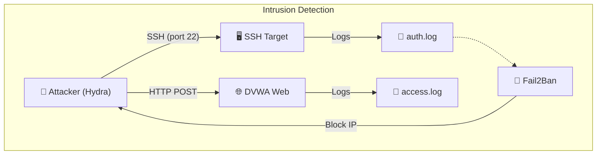

# Módulo 5: Ataques Online

> ⏱️ **Tiempo estimado**: 60 minutos

## 🎯 Objetivos de Aprendizaje

- Diferenciar ataques offline vs online
- Utilizar Hydra para brute-forcing de servicios
- Comprender limitaciones y mitigaciones
- Aplicar rate limiting y detección de intrusiones

## 📖 Teoría

### Arquitectura de Ataque Online



### Offline vs Online

| Aspecto | Offline | Online |
|---------|---------|--------|
| **Velocidad** | Millones H/s | Cientos/segundo |
| **Detección** | Imposible | Alta probabilidad |
| **Requisitos** | Hash obtenido previamente | Acceso al servicio |
| **Mitigaciones** | Hashing fuerte | Rate limiting, lockout |

### ¿Por qué Online es más lento?

1. **Latencia de red**: Cada intento requiere una petición/respuesta
2. **Rate limiting**: Servicios limitan intentos por IP
3. **Account lockout**: Bloqueo tras N intentos fallidos
4. **CAPTCHA**: Validación humana

### Servicios comunes atacables

- **SSH** (puerto 22): Acceso remoto a servidores
- **FTP** (puerto 21): Transferencia de archivos
- **HTTP/HTTPS**: Formularios de login
- **RDP** (puerto 3389): Escritorio remoto Windows
- **SMB** (puerto 445): Compartición de archivos Windows

---

## 🛠️ Herramientas

### Hydra

```bash
# Sintaxis general
hydra -l [usuario] -P [wordlist] [protocolo://]host[:puerto] [opciones]

# Opciones útiles
-l usuario          # Login específico
-L users.txt        # Lista de usuarios
-p password         # Password específico
-P passwords.txt    # Lista de passwords
-t N                # Parallel tasks (threads)
-vV                 # Verbose
-f                  # Stop when found
```

### Protocolos soportados

```bash
hydra -h | grep "Supported services"
```

Incluye: ssh, ftp, http-get, http-post-form, smb, rdp, mysql, postgres, etc.

---

## 💻 Ejercicios Prácticos

### Entorno del Laboratorio

Servicios vulnerables corriendo en Docker:

```
ssh-target:2222    → Usuario: testuser, Password: password123
dvwa:80            → Múltiples usuarios con passwords débiles
```

### Ejercicio 1: SSH Brute Force 🟢

```bash
# Verificar conectividad
nc -zv ssh-target 2222

# Ataque básico con usuario conocido
hydra -l testuser -P /wordlists/rockyou-subset.txt ssh://ssh-target:2222 -t 4

# Más verboso
hydra -l testuser -P /wordlists/rockyou-subset.txt ssh://ssh-target:2222 -t 4 -vV

# Parar al encontrar
hydra -l testuser -P /wordlists/rockyou-subset.txt ssh://ssh-target:2222 -t 4 -f
```

**Pregunta**: ¿Cuánto tardó en encontrar la contraseña?

---

### Ejercicio 2: HTTP POST Form (DVWA) 🟡

DVWA tiene un formulario de login en `/login.php`.

#### Paso 1: Analizar el formulario

```bash
# Inspeccionar con curl
curl http://dvwa/login.php

# Identificar:
# - Campos del form: username, password
# - URL de acción: login.php
# - Mensaje de error: "Login failed"
```

#### Paso 2: Construir comando Hydra

```bash
# Sintaxis para HTTP POST
hydra -l admin -P /wordlists/rockyou-subset.txt dvwa http-post-form \
  "/login.php:username=^USER^&password=^PASS^&Login=Login:Login failed" -t 4
```

Explicación:
- `^USER^` → Reemplazado por usuario
- `^PASS^` → Reemplazado por password
- `:Login failed` → String que indica fallo

**Credenciales por defecto en DVWA**:
- admin/password
- admin/admin
- gordonb/abc123
- 1337/charley
- pablo/letmein
- smithy/password

---

### Ejercicio 2b: Ataque Web Moderno con FFUF 🚀

Hydra es clásico, pero herramientas modernas como **FFUF** (Fuzz Faster U Fool) son más rápidas y flexibles para HTTP.

**Ventajas de FFUF**:
- Escrito en Go (muy rápido)
- Fácil filtrado de respuestas (por tamaño, código, palabras)
- Más transparente con peticiones HTTP

```bash
# Ataque con FFUF al login de DVWA
# -w: wordlist
# -X POST: método
# -d: datos (body)
# -mr: match regex (validar éxito) o -fr (filtrar regex de fallo)

ffuf -w /wordlists/rockyou-subset.txt -u http://dvwa/login.php \
     -X POST -H "Content-Type: application/x-www-form-urlencoded" \
     -d "username=admin&password=FUZZ&Login=Login" \
     -fr "Login failed"
```

**Análisis**: FFUF probará cada palabra en `FUZZ`. La opción `-fr "Login failed"` ocultará las respuestas que contengan "Login failed", mostrando solo la correcta.

---

### Ejercicio 3: Múltiples usuarios SSH 🔴

```bash
# Crear lista de usuarios
cat > /tmp/users.txt << EOF
root
admin
testuser
user
demo
EOF

# Ataque con múltiples usuarios
hydra -L /tmp/users.txt -P /wordlists/rockyou-subset.txt ssh://ssh-target:2222 -t 4
```

---

## 🛡️ Mitigaciones y Defensas

### Fail2Ban

Herramienta que bloquea IPs tras N intentos fallidos.

**Configuración ejemplo** (no ejecutar en el lab):

```ini
[sshd]
enabled = true
port = ssh
filter = sshd
logpath = /var/log/auth.log
maxretry = 3
bantime = 3600
```

### Rate Limiting en aplicaciones web

```python
# Ejemplo Flask con rate limiting
from flask_limiter import Limiter

limiter = Limiter(app, key_func=get_remote_address)

@app.route("/login", methods=["POST"])
@limiter.limit("5 per minute")
def login():
    # Login logic
    pass
```

### CAPTCHA

Google reCAPTCHA previene ataques automáticos:

```html
<form action="/login" method="POST">
  <input name="username" type="text">
  <input name="password" type="password">
  <div class="g-recaptcha" data-sitekey="YOUR_SITE_KEY"></div>
  <button type="submit">Login</button>
</form>
```

---

## 🔬 Experimentos Adicionales

### Comparar tiempos con diferentes threads

```bash
# 1 thread
time hydra -l testuser -P /wordlists/rockyou-subset.txt ssh://ssh-target:2222 -t 1

# 4 threads
time hydra -l testuser -P /wordlists/rockyou-subset.txt ssh://ssh-target:2222 -t 4

# 16 threads (puede ser contraproducente)
time hydra -l testuser -P /wordlists/rockyou-subset.txt ssh://ssh-target:2222 -t 16
```

**Resultado esperado**: 4 threads es ~4x más rápido que 1, pero 16 threads puede causar errores.

---

## 🌍 Caso Real: SSH Botnets

### Mirai Botnet (2016)

- Scaneó Internet en busca de dispositivos IoT
- Probó **61 combinaciones** de usuario/password por defecto:
  - admin/admin
  - root/root
  - admin/password
  - support/support
  
**Resultado**: 600,000 dispositivos comprometidos.

**Lección**: Cambiar credenciales por defecto es crítico.

---

## 📊 Detección de Ataques

### Logs a monitorear

```bash
# SSH failed attempts (Linux)
grep "Failed password" /var/log/auth.log

# Web server (Apache/Nginx)
grep "POST /login" /var/log/nginx/access.log | grep "401\|403"
```

### Patrones de ataque

- **Múltiples intentos fallidos** desde misma IP
- **Patrones secuenciales** (admin, admin1, admin2)
- **User-Agent** de herramientas conocidas (Hydra, Medusa)
- **Velocidad anormal** (100 intentos/minuto)

---

## 🤔 Consideraciones Éticas

> [!WARNING]
> Ataques online contra servicios **SIN AUTORIZACIÓN** son **ilegales** en la mayoría de jurisdicciones.

### Cuándo es legal

- ✅ Pentest con contrato firmado
- ✅ Bug bounty programs autorizados
- ✅ Sistemas propios de prueba (como este laboratorio)

### Consecuencias legales

- España: hasta **3 años de prisión** (Art. 197 Código Penal)
- USA: Computer Fraud and Abuse Act (CFAA) - hasta 10 años
- Muchos países tienen legislación similar

---

## 🧰 Alternativas a Hydra

### Medusa

```bash
# Similar a Hydra pero con diferentes optimizaciones
medusa -h ssh-target -u testuser -P /wordlists/rockyou-subset.txt -M ssh
```

### Ncrack

```bash
# Parte de la suite Nmap
ncrack -u testuser -P /wordlists/rockyou-subset.txt ssh://ssh-target:2222
```

---

## ✅ Criterios de Completitud

Has completado este módulo cuando:

- [ ] Crackeaste exitosamente SSH con Hydra
- [ ] Atacaste el formulario DVWA
- [ ] Comprendiste diferencias offline vs online
- [ ] Identificaste al menos 3 mitigaciones
- [ ] Reflexionaste sobre aspectos éticos y legales

---

🔙 [Anterior: Módulo 4 - Reglas](../module4/README.md) | 🔜 [Siguiente: Módulo 6 - Credential Stuffing](../module6/README.md)
