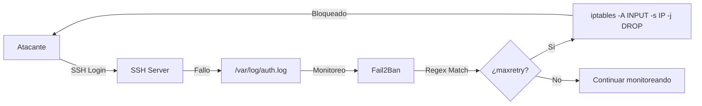

# Módulo 8b: Práctica con Fail2Ban

> ⏱️ **Tiempo estimado**: 30 minutos

```bash
# Antes de comenzar, sitúate en el directorio del módulo:
cd /exercises/module8b
```

## 🎯 Objetivos de Aprendizaje

- Comprender cómo funciona Fail2Ban
- Configurar diferentes políticas de protección
- Observar el efecto de los bans en tiempo real
- Gestionar IPs bloqueadas manualmente

## 📖 Teoría

### ¿Qué es Fail2Ban?

**Fail2Ban** es un sistema de prevención de intrusiones que monitorea logs del sistema y bloquea automáticamente IPs que muestran comportamiento malicioso.



### Componentes Principales

| Componente | Descripción | Ubicación |
|:-----------|:------------|:----------|
| **Jails** | Definen qué servicio proteger | `/etc/fail2ban/jail.local` |
| **Filters** | Expresiones regex para detectar fallos | `/etc/fail2ban/filter.d/` |
| **Actions** | Qué hacer al detectar ataque | `/etc/fail2ban/action.d/` |

### Parámetros Clave

| Parámetro | Descripción | Ejemplo |
|:----------|:------------|:--------|
| `maxretry` | Intentos fallidos antes de banear | `3` |
| `findtime` | Ventana de tiempo (segundos) | `300` (5 min) |
| `bantime` | Duración del baneo (segundos) | `600` (10 min) |
| `ignoreip` | IPs a ignorar (whitelist) | `127.0.0.1/8` |

---

## 🛠️ Entorno del Laboratorio

Este módulo incluye un contenedor especial con Fail2Ban preconfigurado:

```
ssh-protected:22  → SSH con Fail2Ban activo
                  → Usuarios: testuser/password123, admin/admin2024
```

### Levantar el contenedor

```bash
# Desde la raíz del proyecto
docker-compose up -d ssh-protected

# Verificar que está corriendo
docker-compose ps ssh-protected
```

---

## 💻 Ejercicios Prácticos

### Ejercicio 1: Comparar Protegido vs No Protegido 🟢

Primero, ataca el servidor SSH **sin** protección:

```bash
# Desde el contenedor attacker
hydra -l testuser -P /wordlists/rockyou-subset.txt ssh://ssh-target:2222 -t 1 -f

# Resultado: Encuentra password123 sin problemas
```

Ahora, ataca el servidor **protegido**:

```bash
# Mismo ataque contra ssh-protected
hydra -l testuser -P /wordlists/rockyou-subset.txt ssh://ssh-protected:22 -t 4

# Resultado: Tras 3 intentos fallidos, serás bloqueado
```

**Observa la diferencia**: El ataque contra `ssh-protected` fallará porque Fail2Ban te bloqueará.

---

### Ejercicio 2: Monitorear en Tiempo Real 🟡

Abre **dos terminales**:

**Terminal 1 - Ver logs de Fail2Ban:**
```bash
docker-compose exec ssh-protected tail -f /var/log/fail2ban.log
```

**Terminal 2 - Lanzar ataque:**
```bash
docker-compose exec attacker hydra -l admin -P /wordlists/rockyou-subset.txt ssh://ssh-protected:22 -t 1
```

Verás en Terminal 1 mensajes como:
```
[INFO] Found 172.18.0.X - 2024-01-30 10:15:23
[NOTICE] Ban 172.18.0.X
```

---

### Ejercicio 3: Gestionar IPs Bloqueadas 🟡

```bash
# Entrar al contenedor protegido
docker-compose exec ssh-protected /bin/bash

# Ver estado general de Fail2Ban
fail2ban-client status

# Ver estado del jail SSH
fail2ban-client status sshd

# Ver IPs actualmente baneadas
fail2ban-client get sshd banip

# Desbloquear una IP específica
fail2ban-client set sshd unbanip 172.18.0.5
```

---

### Ejercicio 4: Modificar Configuración 🔴

Vamos a cambiar la configuración para hacerla más permisiva:

```bash
# Copiar configuración permisiva
docker-compose exec ssh-protected bash -c "cat > /etc/fail2ban/jail.local << 'EOF'
[sshd]
enabled = true
port = ssh
filter = sshd
logpath = /var/log/auth.log
maxretry = 10
bantime = 60
findtime = 300
EOF"

# Reiniciar Fail2Ban
docker-compose exec ssh-protected fail2ban-client reload

# Verificar nueva configuración
docker-compose exec ssh-protected fail2ban-client get sshd maxretry
```

Ahora repite el ataque y observa que tarda más en bloquearte.

---

### Ejercicio 5: Probar Diferentes Configuraciones 🔴

El módulo incluye varias configuraciones predefinidas en `configs/`:

| Archivo | maxretry | bantime | Uso |
|:--------|:--------:|:-------:|:----|
| `jail_agresiva.local` | 3 | 1 hora | Servidores críticos |
| `jail_balanceada.local` | 5 | 30 min | Uso general |
| `jail_antispraying.local` | 10 | 24 horas | Contra ataques lentos |
| `jail_permisiva.local` | 20 | 2 min | Testing/demos |

Para aplicar una configuración:

```bash
# Copiar configuración al contenedor
docker cp exercises/module8b/configs/jail_agresiva.local workshop_ssh_protected:/etc/fail2ban/jail.local

# Reiniciar Fail2Ban
docker-compose exec ssh-protected fail2ban-client reload

# Verificar
docker-compose exec ssh-protected fail2ban-client status sshd
```

---

## 📊 Tabla Comparativa de Configuraciones

```
┌─────────────────┬──────────────┬─────────────┬──────────────┐
│ Configuración   │  maxretry    │  bantime    │  findtime    │
├─────────────────┼──────────────┼─────────────┼──────────────┤
│ Agresiva        │      3       │   1 hora    │   5 min      │
│ Balanceada      │      5       │  30 min     │  10 min      │
│ Anti-Spraying   │     10       │  24 horas   │   1 hora     │
│ Permisiva       │     20       │   2 min     │  10 min      │
└─────────────────┴──────────────┴─────────────┴──────────────┘
```

---

## 🔑 Comandos Útiles de Fail2Ban

```bash
# Estado general
fail2ban-client status

# Estado de un jail específico
fail2ban-client status sshd

# Ver todas las IPs baneadas
fail2ban-client get sshd banip

# Banear IP manualmente
fail2ban-client set sshd banip 192.168.1.100

# Desbanear IP
fail2ban-client set sshd unbanip 192.168.1.100

# Recargar configuración
fail2ban-client reload

# Ver configuración actual
fail2ban-client get sshd maxretry
fail2ban-client get sshd bantime
fail2ban-client get sshd findtime

# Ver logs
tail -f /var/log/fail2ban.log
```

---

## 🤔 Preguntas de Reflexión

1. **Trade-offs**: ¿Por qué una configuración muy agresiva (maxretry=1) podría ser problemática?

2. **Evasión**: Con lo aprendido en M9, ¿cómo podrías evadir Fail2Ban?

3. **Detección vs Bloqueo**: ¿Es mejor bloquear inmediatamente o alertar primero y monitorear?

4. **Whitelisting**: ¿Qué IPs deberías incluir en `ignoreip` en un entorno corporativo?

---

## ✅ Criterios de Completitud

Has completado este módulo cuando:

- [ ] Fuiste bloqueado por Fail2Ban al atacar `ssh-protected`
- [ ] Monitoreaste los logs en tiempo real
- [ ] Desbloqueaste tu IP manualmente
- [ ] Modificaste la configuración y probaste el efecto
- [ ] Comparaste al menos 2 configuraciones diferentes

---

🔙 [Anterior: Módulo 8 - Blue Team](../module8/README.md) | 🔜 [Siguiente: Módulo 9 - Evasión](../module9/README.md)
