# Módulo 9: Evasión y Rotación de IPs

> ⏱️ **Tiempo estimado**: 30 minutos

## 🎯 Objetivos de Aprendizaje

-   Comprender las técnicas de defensa: **Rate Limiting** y **Bloqueo de IPs**.
-   Aprender cómo los atacantes evaden estas defensas mediante **Rotación de IPs**.
-   Implementar scripts que utilicen **Redes de Rotación** (Tor, AWS Gateway, Proxies Residenciales).

### Arquitectura de Evasión

```mermaid
    flowchart LR
        A["🦹 Attacker"]
        LB["🔄 IP Rotation<br/>Service"]
        T["✅ Vulnerable API<br/>Rate Limited"]
        
        %% Direct Attack (Blocked)
        A -->|Direct Request IP X| T
        T -.->|⛔ 429 Blocked| A
        
        %% Proxy Attack (Bypass)
        A -->|Request Loop| LB
        LB -->|Tor Exit Node| T
        LB -->|AWS Gateway| T
        LB -->|Residential Proxy| T
        
        style A fill:#f9f,stroke:#333
        style T fill:#bbf,stroke:#333
        style LB fill:#bfb,stroke:#333
```



## 📖 Teoría

### Rate Limiting y Bloqueos
Los sistemas modernos protegen sus endpoints de login limitando el número de intentos permitidos desde una misma dirección IP en un periodo de tiempo (ej: 5 intentos por minuto).

Si un atacante supera este límite:
1.  Recibe un error `429 Too Many Requests`.
2.  Su IP es bloqueada temporalmente (Fail2Ban, WAF).

### IP Rotation (Evasión)
Para continuar el ataque, el adversario necesita cambiar su "identidad" de red (IP de origen) para cada conjunto de intentos.

-   **Proxy Pools**: Listas de miles de proxies públicos o privados (residenciales).
-   **Tor Network**: Enrutamiento anónimo que cambia la IP de salida periódicamente.
-   **Botnets**: Uso de dispositivos infectados dispersos globalmente.
-   **Cloud Gateways**: Uso de AWS API Gateway para rotar IPs (IP Shuffle).

### 🏢 Proxies Residenciales (Nivel Profesional)

A diferencia de Tor (lento, nodos conocidos) o AWS (rango de IPs de datacenter fácil de detectar), los **Proxies Residenciales** enrutan el tráfico a través de dispositivos reales de usuarios domésticos (Wi-Fi, 4G).

**Bright Data (antes Luminati)** es el proveedor líder. Permite:
1.  **Rotación de IP por petición**: Cada request sale por una IP doméstica diferente.
2.  **Targeting Geográfico**: Salir como usuario de "Madrid, España" o "Tokyo, Japón".
3.  **Indetectable**: Para el WAF (Web Application Firewall), eres un usuario legítimo de Vodafone o Movistar.

> 💰 **Coste**: Estos servicios son caros y se pagan por GB transferido.


---

## 💻 Ejercicio Práctico

### Escenario
Nuestra **Vulnerable API** ha sido actualizada con un sistema de defensa. Ahora bloquea cualquier IP que falle 5 intentos seguidos. Tu objetivo es realizar un ataque de fuerza bruta/credential stuffing masivo sin ser bloqueado.

### Paso 1: Verificar el bloqueo 🚫

Intenta atacar sin protección y observa qué ocurre.

Ejecuta el script de prueba de bloqueo:
```bash
docker-compose exec attacker python3 /exercises/module9/verify_block.py
```

Deberías ver cómo tras el intento 5, la API devuelve error 429 y bloquea tu IP.

### Paso 2: Rotación con Tor 🧅

Tenemos un servicio de Tor (`tor-proxy`) en nuestra red. Podemos usarlo como proxy SOCKS5.
Tor cambia el circuito (y por tanto la IP de salida) cada 10 minutos automáticamente, o podemos forzarlo.

En este taller, el servicio está configurado para rotar agresivamente o podemos simular un pool de proxies.

Ejecuta el script de ataque con soporte de Proxy:
```bash
docker-compose exec attacker python3 /exercises/module9/proxy_attack.py
```

### Análisis del código `proxy_attack.py`

El script utiliza `requests` con la extensión SOCKS para enrutar el tráfico a través del contenedor `tor-proxy:9050`.

```python
proxies = {
    'http': 'socks5h://tor-proxy:9050',
    'https': 'socks5h://tor-proxy:9050'
}
resp = requests.post(url, json=data, proxies=proxies)
```

Al usar la red Tor, cada petición (o grupo de peticiones) saldrá por un nodo de salida diferente, evadiendo el bloqueo de IP de la API.

---

## 🛡️ Contramedidas (Defensa Avanzada)

¿Cómo defenderse si el atacante rota IPs?

1.  **Device Fingerprinting**: Identificar el dispositivo por características del navegador (User-Agent, Canvas Fingerprint, TCP/IP stack) en lugar de solo la IP.
2.  **CAPTCHA**: Obligar a resolver un desafío humano si hay sospecha.
3.  **Tor Exit Node Blocklist**: Bloquear tráfico proveniente de nodos de salida de Tor conocidos.
4.  **Behavioral Analysis**: Detectar patrones de comportamiento anómalos (velocidad de tecleo, navegación) independientemente de la IP.

---

## ☁️ Técnica Avanzada: AWS API Gateway

Otra técnica potente es usar infraestructura en la nube para rotar IPs. AWS API Gateway permite crear un "passthrough" que redirige tráfico. Como AWS tiene un pool de IPs masivo, cada petición puede salir por una IP distinta.

### Guía de Configuración AWS

Para usar el script `aws_gateway_attack.py`, necesitas una cuenta AWS y credenciales.

#### 1. Crear Cuenta AWS (Free Tier)
Si no tienes cuenta, crea una en [aws.amazon.com](https://aws.amazon.com/). Necesitarás una tarjeta de crédito, pero el "Free Tier" incluye 1 millón de llamadas a API Gateway gratis al mes (durante los primeros 12 meses).

#### 2. Crear un Usuario IAM (Programmatic Access)
No uses tu cuenta "Root" para scripts.
1.  Ve a la consola **IAM** (Identity and Access Management).
2.  Haz clic en **Users** -> **Create user**.
3.  Nombre: `ip-rotator-user`.
4.  **Permissions options**: Selecciona "Attach policies directly".
5.  Busca y selecciona: `AmazonAPIGatewayAdministrator` (o crea una policy más restrictiva si sabes cómo).
6.  Crea el usuario.

#### 3. Generar Access Keys
1.  Entra en el usuario recién creado (`ip-rotator-user`).
2.  Ve a la pestaña **Security credentials**.
3.  Baja a **Access keys** y haz clic en **Create access key**.
4.  Selecciona "Application running outside AWS".
5.  Copia el **Access key ID** (ej: `AKIA...`) y el **Secret access key** (ej: `wJalrX...`).
    *   ⚠️ **IMPORTANTE**: Guarda el Secret Key ahora. No podrás verlo después.

#### 4. Configurar el Script
Edita el archivo `exercises/module9/aws_gateway_attack.py` y sustituye los valores:

```python
AWS_ACCESS_KEY_ID = "AKIAIXXXXXXXXXXXX"
AWS_SECRET_ACCESS_KEY = "wJalrXUtnFEMIxK7MDENG/bPxRfiCYEXAMPLEKEY"
AWS_REGION = "us-east-1"
```

#### 5. Ejecutar la Demo
```bash
python3 aws_gateway_attack.py
```
El script creará automáticamente una API en tu cuenta AWS, lanzará peticiones a través de ella (rotando IPs), y luego la borrará.

### 🏢 Opción B: PlainProxies.com

Si utilizas **PlainProxies.com**, usa el script alternativo `plainproxies_attack.py`.

```bash
docker-compose exec -e PP_USERNAME='USER_ID-country-ES' \
                    -e PP_PASSWORD='...' \
                    -e PP_HOST='res-v2.pr.plainproxies.com' \
                    -e PP_PORT='8080' \
                    -e TARGET_URL='https://...' \
                    attacker python3 /exercises/module9/plainproxies_attack.py
```

> **Nota**: PlainProxies permite filtrar por país añadiendo `-country-XX` al usuario (ej: `-country-ES` para España).

>
> **⚠️ Usuarios de Trial**: Si tienes una cuenta Bright Data sin verificar (Trial), bloquearán el acceso a dominios `.dev` o `.ngrok`. Usa `DEMO_MODE=true` para probar la rotación contra `lumtest.com`.

### 🏙️ Técnica: Bright Data (Proxies Residenciales)

Si tienes una suscripción a Bright Data (o prueba gratuita), puedes usar su "Super Proxy" para rotación ilimitada de IPs residenciales.

#### Configuración

1.  Obtén tus credenciales de Bright Data (Username de Zona y Password).
2.  Ejecuta el script pasando las variables de entorno:

    ```bash
    # Ejecución pasando credenciales y URL objetivo
    docker-compose exec -e BD_USERNAME='...' \
                        -e BD_PASSWORD='...' \
                        -e TARGET_URL='https://tu-url.ngrok-free.app' \
                        attacker python3 /exercises/module9/brightdata_attack.py
    ```

    > **Tip**: Para no escribir el comando entero cada vez, puedes exportar las variables antes:
    > ```bash
    > export BD_USERNAME='...'
    > export BD_PASSWORD='...'
    > export TARGET_URL='https://...'
    > ```


El script añade automáticamente un identificador de sesión aleatorio al usuario del proxy (`-session-RAND`) en cada petición. Esto fuerza a la infraestructura de Bright Data a asignar una **nueva IP** para cada intento de login.

 
### ⚠️ Exposición Pública con Ngrok (Avanzado)

Para simular un ataque real desde Tor, el objetivo debe ser accesible públicamente. Puedes usar `ngrok` para exponer temporalmente tu `vulnerable-api`, pero **toma precauciones**.

#### 1. Preparar la API (Seguridad)
Por defecto, la API corre en modo DEBUG, lo que permite ejecución remota de código (RCE). Antes de exponerla, **desactiva el modo debug**:

1. Edita `docker-compose.yml`:
   ```yaml
   workshop_vulnerable_api:
     environment:
       - FLASK_DEBUG=false  # <--- Añadir esto
   ```
2. Reinicia el contenedor:
   ```bash
   docker-compose up -d --force-recreate workshop_vulnerable_api
   ```

#### 2. Lanzar Ngrok
Expone el puerto 5000:

```bash
ngrok http 5000
# Copia la URL generada (ej: https://a1b2c3d4.ngrok-free.app)
```

#### 3. Actualizar el Script de Ataque
Modifica `proxy_attack.py` (o `aws_gateway_attack.py`) para atacar tu dominio ngrok en lugar de `http://vulnerable-api:5000`.

> [!CAUTION]
> **Detén ngrok inmediatamente** al terminar el ejercicio. No dejes servicios vulnerables expuestos innecesariamente.


---

🔙 [Anterior: Módulo 8 - Detección y Defensa](../module8/README.md) | 🔜 [Siguiente: Módulo 10 - Phishing 2FA](../module10/README.md)
